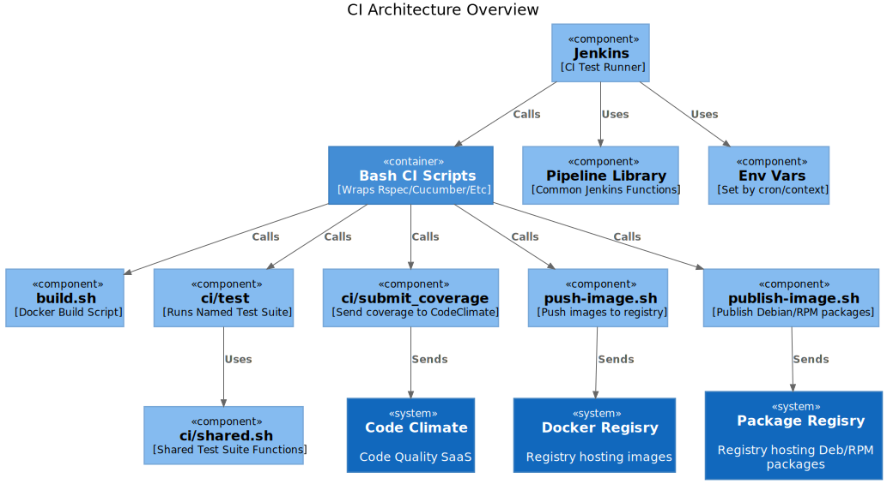
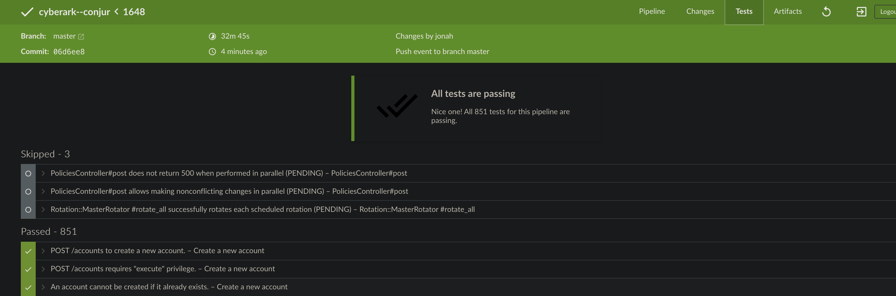
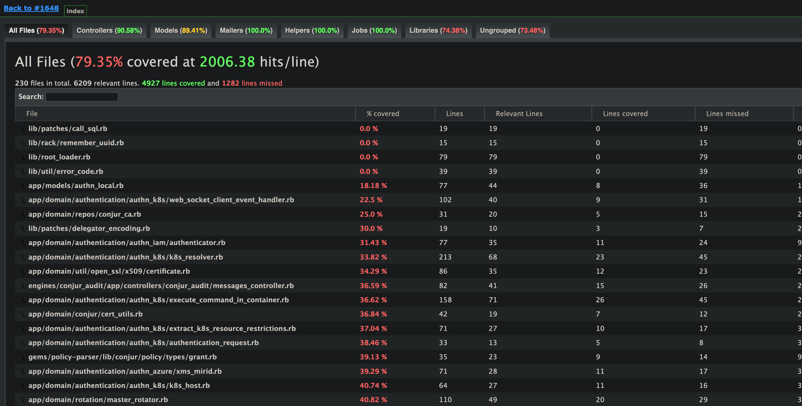

## Jenkins CI Architecture

## Overview

Our CI pipeline runs on Jenkins, and the main entrypoint for the whole process is the `Jenkinsfile` in the root directory.

This file, however, is only the tip of the iceberg...

## Jenkins Dependencies

The `Jenkinsfile` itself has 3 main dependencies:

1. **Our many bash scripts.** These are located in the root directory root and under `ci`, and perform, or delegate, the real work of the CI -- running tests in cucumber or rspec, processing test results, and spinning up infrastructure in cases where Jenkins itself cannot.

2. **Jenkins functions.** In addition to the [built-in Jenkins functionality](https://www.jenkins.io/doc/book/pipeline/syntax/), this includes a number of [custom Jenkins functions](https://github.com/conjurinc/jenkins-pipeline-library/tree/master/vars) that we maintain ourselves.

3. **Environment variables.** These are set automatically by Jenkins, depending on the context that triggers the CI run.  It  includes variables like `env.BRANCH_NAME` and `env.STAGE_NAME`, for example.  [Here is a full list](https://devopsqa.wordpress.com/2019/11/19/list-of-available-jenkins-environment-variables/).

More on these below.

## Bash Scripts

Breakdown basic organization.  How it should work for normal case.  

### GKE Tests

Exception to rule.  Needed because we don't have agents.  Doesn't fit into paradigm.  Lots of code.

## Displaying Test Results

### `junit`

The Jenkins `junit` command is a plugin that processes test results and can then render them in different ways -- like this display in the Blue Ocean "Test" tab:

### `publishHTML`

Similarly, publishHTML makes test coverage reports available:

### More Notes TBD

Notes about craziness of submit_coverage, merging, because we have to submit all at once.

## ci/submit_coverage

How the GKE tests make this way more complex than it needs to be.  Also the constraint that we have to push them all at once.

Note: to edit this diagram see README_CI.puml